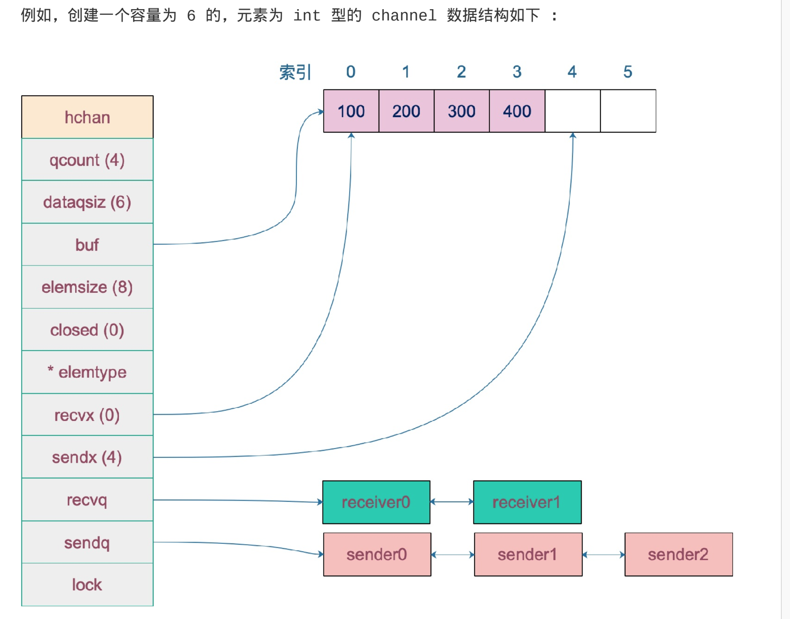

## channel
### channel的底层数据结构
```go
type hchan struct{
	// chan 数据量
	qcount uint
	// chan 底层循环数组的长度
	dataqsiz uint 
	// 指向底层循环数组的指针，只针对有缓冲的channel
	buf unsafe.Pointer
	// chan 中元素大小
	elemsize uint16
	// channel 关闭标志
	closed uint32
	// channel 中元素类型
	elemtype *_type
	// 已发送数据在循环数组中的索引
	sendx uint
	// 已接收元素在循环数组中的索引
	recvx uint
	// 等到接收的goroutine 队列
	recvq waitq
	// 等待发送的goroutine队列
	sendq waitq
	
	// 互斥保护数据
	lock mutex
}
```
`waitq`是`sudog`的一个双向链表，`sudog`是对`goroutine`的封装。
```go
type waitq struct {
	first *sudog
	last *sudog
}
```

## 创建
使用`make`就可以创建一个能收能发的通道。
```go
// 无缓冲通道
ch1 := make(chan int)
// 有缓冲通道
ch2 := make(chan int, 10)
```
通过分析最终创建`chan`的函数为`makechan`:
```go
const hchansize = unsafe.Sizeof(hchan{}) + uintptr(-int(unsafe.Sizeof(hchan{})) & (maxAlign - 1))
func makechan(t *chantype, size int64)*hchan{
	elem := t.elem
	// 省略检查channel size,align的代码
	// ...
	
	var c *hchan
	// 如果元素类型不含指针或者size大小为0(无缓冲类型)
	// 只进行一次内存分配
	if elem.kind & kindNoPointer != 0 || size == 0 {
		// 如果hchan结构体中不含指针，GC就不会扫描chan中的元素
		// 只分配"hchan结构体大小+元素大小*元素个数"大小的内存
		c = (*hchan)(mallocgc(hchanSize + uintptr(size) * elem.size, nil ,true))
		// 如果是缓冲型channel且元素大小不为0(大小等于0的元素类型:struct{})
		if size > 0 && elem.size == 0{
			c.buf = add(unsafe.Pointer(c), hchansize)
		} else {
			// 非缓冲型的，buf没用，直接指向chan的起始地址处
			// 缓冲型的，能进入到此处说明元素类型无指针且元素类型为struct{}，业务影响
			// 因为只会用到接收和发送游标，不会真正的拷贝东西到c.buf处(覆盖chan的内容)
			c.buf = unsafe.Pointer(c)
		}
	} else {
		// 两次内存分配
		c = new(chan)
		c.buf = newarray(elem, int(size))
	}
	
	c.elemsize = uint16(elem.size)	
	c.elemtype = elem
	// 循环数组长度
	c.dataqsiz = uint(size)
	// 返回chan指针
	return c
}
```
  

### channel发送和接收数据的本质
channel的本质是值拷贝。
e.g.
```go
package main

import (
	"fmt"
	"time"
)

type user struct {
	name string
	age  int8
}

var u = user{name: "Ankur", age: 13}
var g = &u

func modifyUser(pu *user) {
	fmt.Println("modifyUser Receieved Value ", pu)
	pu.name = "Anand"
}

func printUser(u <-chan *user) {
	time.Sleep(2 * time.Second)
	fmt.Println("printUser goRoutine called", <-u)
}

func main() {
	c := make(chan *user, 5)
	c <- g
	fmt.Println(g)

	g = &user{name: "Ankur Anand", age: 100}
	go printUser(c)
	go modifyUser(g)
	time.Sleep(5 * time.Second)
	fmt.Println(g)
}
```
示例创建方式：
  

**Remember all transfer of value on the go channels happens with the copy of value.**
### 源码分析
接收操作的两种写法：
> 1. 带`ok`,反应`channel`是否关闭；
> 2. 不带`ok`,这种写法当接收到相应的零值，无法知道是否是真实的发送者发送的值，还是`channel`关闭后返回的零值。
经编译器处理后，对应的源码的函数为：
```go
// entry points for <- c from compiled code
func chanrecv1(c *hchan, elem unsafe.Pointer){
	chanrecv(c, elem, true)
}

func chanrecv2(c *hchan, elem unsafe.Pointer)(received bool){
	_, received = chanrecv(c, elem, true)
	return 
}
```
接收值会放到参数`elem`所指向的地址。
```go
// 位于src/runtime/chan.go
// chanrecv 函数接收channel c 的元素，并将其写入ep所指向的内存地址。
// 如果ep为nil，表示忽略了接收值
// 如果block == false,表示非阻塞型接收，在没有数据可接收的情况下返回<false, false>
// 否则，如果c处于关闭状态，则将ep的地址清零，返回<true, false>
// 否则用返回值填充ep指向的内存地址，返回<true, true>
// 如果ep非空，则应该指向堆或者函数调用者栈
func chanrecv(c *hchan, ep unsafe.Pointer, block bool)(selected, received bool){
	// 省略 debug的内容....

	// 如果是一个nil的channel
	if nil == c {
		// 如果不阻塞返回<false, false>
		if !block {
			return 
		}
    // 否则接收一个nil的channel, goroutine挂起
    gopark(nil, nil, "chan receive (nil chan)", traceEvGoStop, 2)

    // 不会执行到此处
    throw("unreachble")
	}

  // 非阻塞模式下，快速检测到失败快速返回，不用获取锁
  // 当我们观察到channel没准备好接收
  // 1. 非缓冲型，等待发送队列，sendq 里没有goroutine等待
  // 2. 缓冲型，但buf中没有数据
  // 观察到closed == 0即channel 关闭
  // 因为channel不可能重复打开，所以上一次观测channel处于打开状态
  // 因此这种情况下可以返回失败<false, false>
  if !block && (c.dataqsiz == 0 && c.sendq.first == nil || c.dataqsiz > 0 && atomic.Loaduint(&c.qcount) == 0) && atomic.Load(&c.closed) == 0 {
    return 
  }

  var t0 int64
  if blockprofilerate > 0 {
    t0 = cputicks()
  }

  // 加锁
  lock(&c.lock)
  
	// chan 已关闭，并且循环数组buf中没有元素
	// 这里可以处理非缓冲型关闭和缓冲型关闭但buf无元素
	// 即：在channel关闭的情况下，在有缓冲的channel，
	// 如果buf存在数据，还能接收到元素

	if c.closed != 0 && c.qcount == 0 {
		if raceenabled {
			racecquire(unsafe.Pointer(c))
		}
		// 解锁
		unlock(&c.lock);
		if eq != nil {
			// 从一个channel接收操作，且忽略返回值
			// 那么接收的值将是该类型的零值
			// typedmemclr根据类型清理相应类型的内存
			typedmemclr(c.elemtype, ep)
		}

		// 从一个已关闭的channel接收数据，selected返回true
		return true, false
	}

	// 等待发送队列里有goroutine 说明buf是满的
	// 这有可能
	// 1. 非缓冲型channel
	// 2. 缓冲型的channel 但buf满了
	// 针对1，直接进行内存拷贝(从sender goroutine --> receiver goroutine)
	// 针对2，接收到循环数组头部的元素，并将发送者的元素放到循环数组的尾部
	if sg := c.sendq.dequeue(); sg != nil {
		recv(c, sg, ep, func(){unlock(&c.lock)}, 3)
		return true, true
	}

	// 缓冲型，buf中有数据，可以正常结束
	if c.qcount > 0 {
		// 直接从循环数组中找到要接收的元素
		qp := chanbuf(c, c.recvx)
		// ................

		// 代码里，没有忽略要接收的值，不是 "<-ch", 而是 "val <- ch"指向val
		if ep != nil {
			typedmemmove(c.elemtype, ep, ep)
		}

		// 清理掉循环数组里相应位置的值
		typedmemclr(c.elemtype, qp)
		// 接收游标向前移动
		c.recvx++
		// 接收游标归0
		if c.recvx == c.dataqsiz {
			c.recvx = 0
		}

		// buf数组元素个数减1
		c.qcount--
		// 解锁
		unlock(&c.lock)
		return true, true
	}
	if !block {
		// 非阻塞接收，解锁, selected返回false,因为没有接收到值
		unlock(&c.lock)
		return false, false
	}

	// 被阻塞的情况
	// 构造一个sudog
	gp := getg()
	mysg := acquireSudog()
	mysg.releasetime = 0
	if t0 != 0 {
		mysg.releasetime = -1
	}

	// 待接收数据的地址保存下来
	mysg.elem = ep
	mysg.waitlink = nil
	gp.waiting = mysg
	mysg.g = gp
	mysg.selectdone = nil
	mysg.c = c
	gp.param = nil

	// 进入channel 的等待接收队列
	c.recvq.enqueue(mysg)
	// 将当前goroutinue挂起
	goparkunlock(&c.lock, "chan receieve", traceEvGoBlockRecv, 3)

	// 被唤醒了，接着从这里执行一些扫尾工作
	if mysg != gp.waiting {
		throw ("G waiting list is corrupted")
	} 

	gp.waiting = nil
	if mysg.releasetime > 0 {
		blockevent(mysg.releasetime-t0, 2)
	}

	closed := gp.param == nil
	gp.param = nil
	mysg.c = nil
	releaseSudog(mysg)
	return true, !closed
}
```
分析源码可知：
* 如果`channel`是一个空值(`nil`),非阻塞模式下可以直接返回。在阻塞模式下，会调用`gopark`函数挂起`goroutinue`, 这个会一直阻塞下去。因为在`channel`是`nil`的情况下，要不想阻塞只能关闭`channel`，但关闭一个为`nil`的`channel`会发生`panic`。
* 和发送函数一样，在非阻塞模式下，不用获取锁，快速检测到失败并返回的操作。
**在编写代码时，通过找到一些边界条件，快速返回。**
```go
// 在非阻塞的情况下，快速检测到失败，不用获取锁，快速返回(false, false)
if !block && ( c.dataqsiz == 0 && c.sendq.first == nil || c.dataqsiz > 0 && atomic.Loaduint(&c.qcount) == 0) && atomic.Load(&c.closed) == 0 {
	return
}
```

