# `GO`设计与实现
## 编译原理
抽象语法树(`AST`): 源代码语法结构的一种抽象表示，用树状的方式表示编程语言的语法结构。
抽象语法树中的每个节点表示源代码中的一个元素，每颗子树表示一个语法结构。
`e.g. 2 * 3 + 7`的抽象语法树：
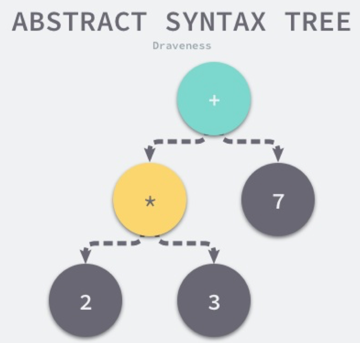  
抽象语法树去除了源代码中的不重要字符，如空格，括号和分号等。
### 静态单赋值
`Static Single Assigment(SSA)`: 中间代码的一个特性。
如果一个代码具有静态单赋值特性，那么每个变量只会被赋值一次。
```go
x := 1
x := 2
y := x
```
如上述代码中，`x`被赋值多次，但`x := 1`在代码中是无用的。
在中间代码中使用`SSA`特性能够使程序实现以下优化：
1. 常数传播(`constant propagation`);
2. 值域传播(`value range propagation`);
3. 稀疏有条件的常数传播(`spare conditional constant propagation`);
4. 消除无用的程式码(`dead code elimination`);
5. 全域数值编号(`global value numbering`);
6. 消除部分冗余(`partial redundancy elimination`);
7. 强度折减(`strength reduction`);
8. 寄存器分配(`register allocation`)。

### 编译器
`go`的编译器源代码存储在`src/cmd/compile`。
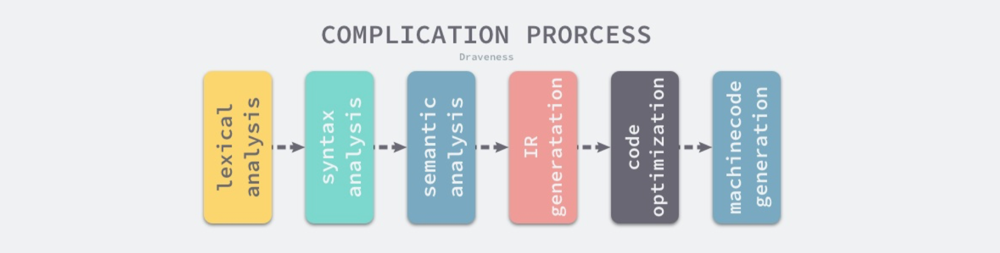  
`go`编译器由如下几个部分组成：词法与语法分析器，类型检查和`AST`转换，通用`SSA`生成和机器码生成。
#### 词法与语法分析器
所有的编译过程都是从解析源代码文件开始的。
词法分析的作用：解析源代码文件，将源代码文件中的字符串系列转换为`Token`序列。一般将词法分析器称之为`lexer`。
语法分析的作用: 将词法分析生成的`Token`按照语言定义好的文法`Grammar`自上而下或者自下而上的进行规约，每一个`GO`源代码文件都会被规约成一个`SourceFile`结构。
```go
SourceFile := PackageClause ";" {ImportDecl ";"} {TopLevelDecl ";"}
```
词法分析会返回一个不包含空格，换行等的`Token`序列。例如：`package`, `json`, `import`, `(`... 语法分析将`Token`序列装成有意义的结构体，也就是语法树：
```go
"json.go": SourceFile{
  PackageName: "json",
  ImportDecl: []Import{
    "io",
  },
  TopLevelDecl: ...
}
```
每个抽象语法树(`AST`),包含当前文件属于的包名，定义的常量，结构体和函数等。
**每一个的`AST`都对应一个单独的`GO`文件.**
### 类型检查
检查类型定义，同时将对应的函数展开。
在这个阶段，`make`关键字会被替换成`makeslice`,`makechan`等函数。
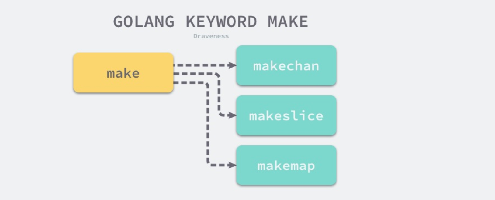
类型检查之后，通过`complileFunctions`函数，开始编译全部函数。
这些函数会在一个工作队列里被多个协程消费。
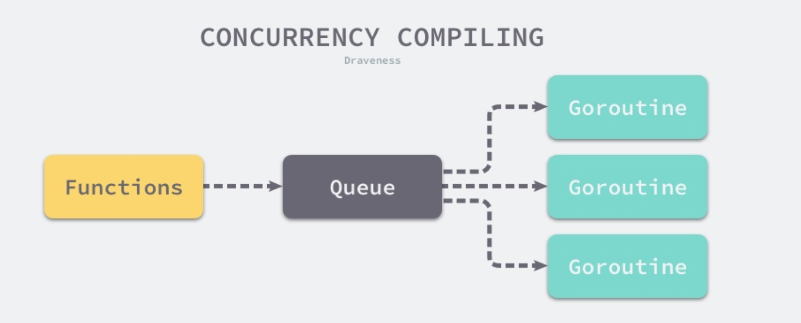
### 数组
#### 初始化
```go
arr1 := [3]int{1,2,3}
arr2 := [...]int{1,2,3} // 产生数组大小推导
```
字面量数组处理：
> 1. 长度小与或等于`4`，直接将数组元素放置到栈上；
> 2. 长度大于`4`，将数组元素放置到静态区，并在运行时取出。

数组是一块连续的内存区，所以数组的算法需要以下参数：
> 1. 数组的首地址；
> 2. 数组元素个数；
> 3. 数组元素类型。

### 切片
切片结构：
```go
type SliceHeader struct {
  Data uintptrt // 指向数组的指针
  Len int // 当前切片长度
  Cap int // 当前切片的容量
}
```

`slice`追加操作：
> 1. 容量满足时，直接在data指针地址后追加元素；
> 2. 容量不满足时，进入`growslice`的流程，对原`slice`进行扩容，扩容完成之后，追加元素。

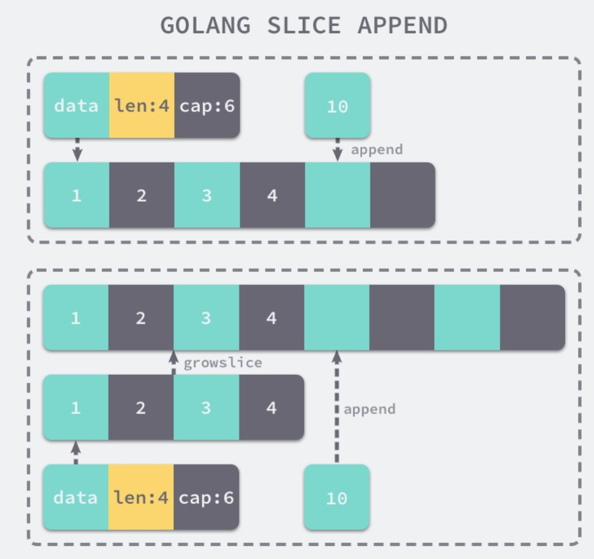
`slice`扩容策略:
1. 期望容量大于当前容量的`2`倍时，使用期望容量作为新的容量;否则：
2. 如果当前容量小与`1024`时,就会将容量翻倍；
3. 如果当前容量大于`1024`时，每次扩容`25%`,直到新的容量大于期望容量。

#### 切片拷贝
内存拷贝：
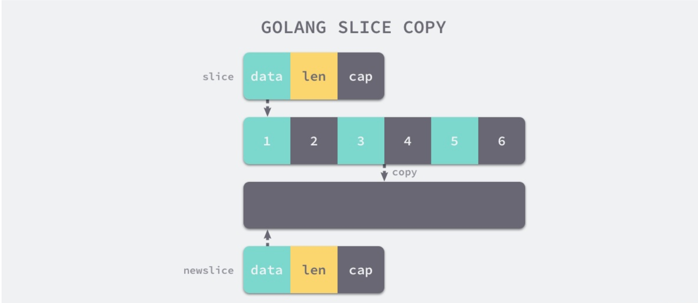

内存拷贝是通过拷贝整块内存实现。

### 哈希表
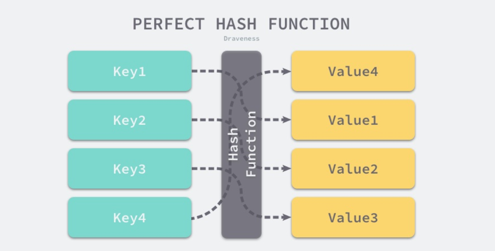
冲突解决：
1. 开放寻址法
   `key`发生冲突时，则将依次探索下一个空白地址处。
   $index := hash("author") \% array.len $
   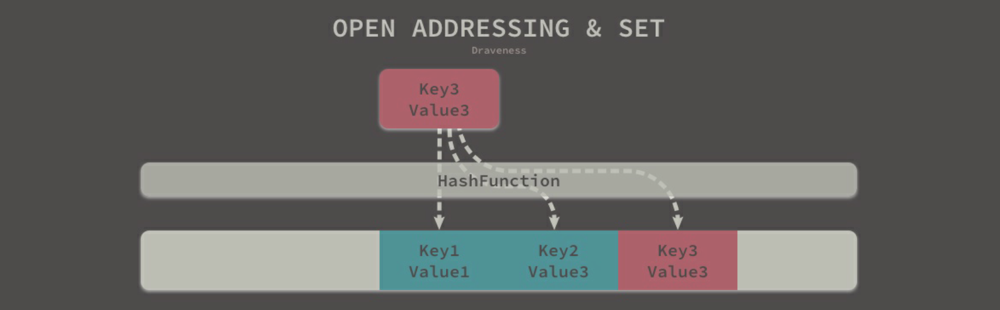
   `get与set`操作：
   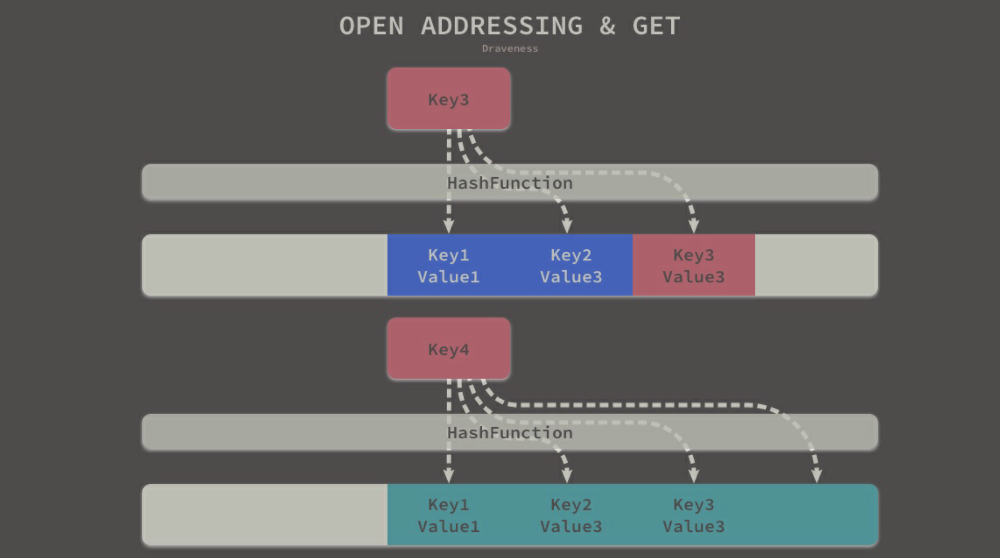


2. 拉链法
   将冲突的`key`存入到一个链表中。
   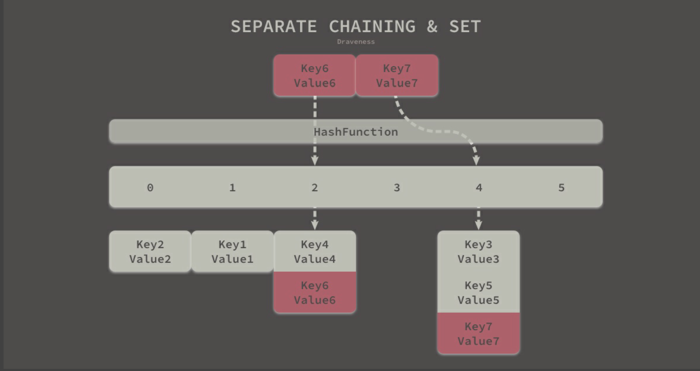
   

#### 哈希表实现
```go
type hmap struct {
  count int // 哈希表数量
  flags uint8 
  B uint8 // 哈希表持有的buckets个数
  noverflow uint8
  hash0 uint32 // 哈希种子
  buckets unsafe.Pointer 
  oldbuckets unsafe.Pointer // 哈希表扩容时保存的之前的buckets字段，当前buckets大小的一半
  nevacuate uintptr
  extra *mapextra
}
```
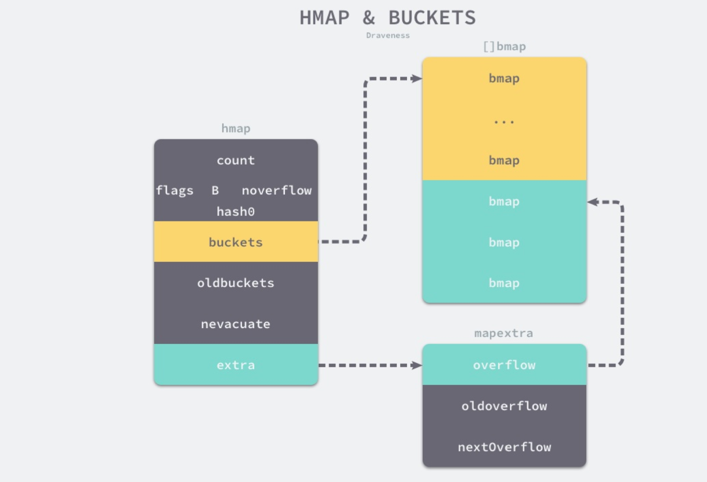
`bmap`对应一个`hash buckets`,每个`bmap`可以存储`8`个元素，超出部分放置到`extra`中。
```go
type bmap struct {
  topbits [8]uint8
  keys [8]keytype
  values [8]valuetype
  pad uintptr
  overflow uintptr
}
```
`hash`元素个数超过`25`个时，`key和val`分别存储到`两个数组`中。如下图：
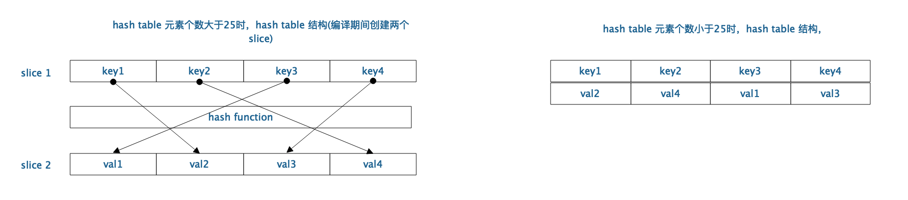
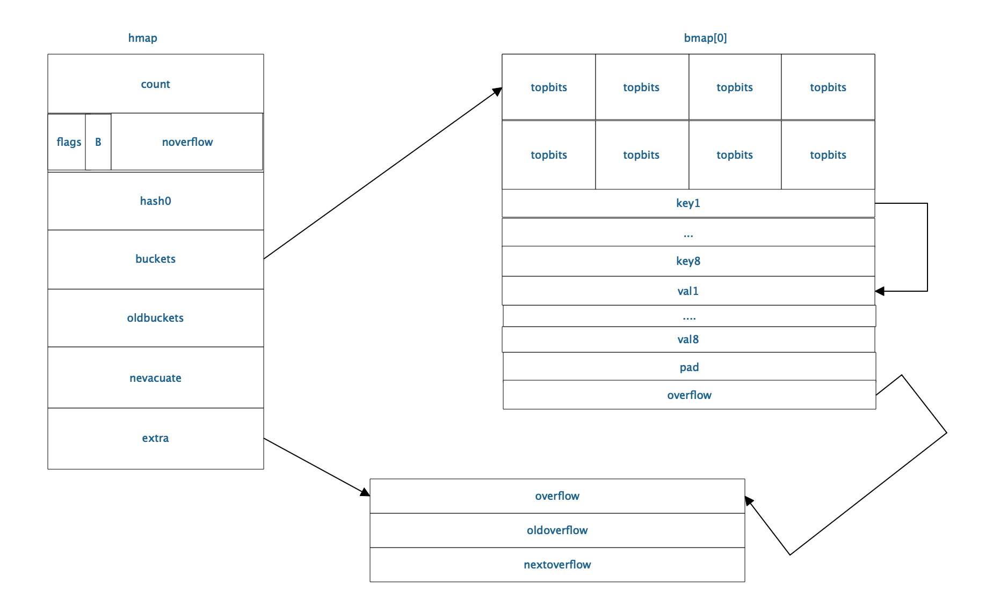
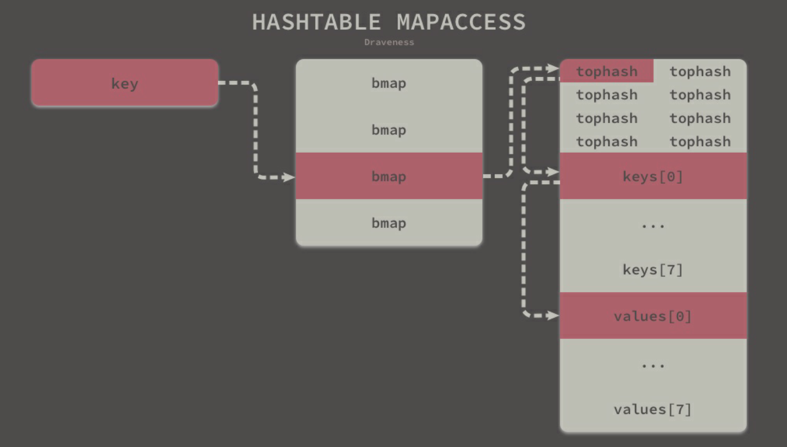
在初始化`map`时，桶的个数下于$2^4$时，使用溢出桶的概率较小；
否则需要创建$2^{B-4}$个溢出桶。
#### 哈希表扩容
扩容的时机：
1. 装载因子超过6.5;
2. 哈希使用了太多溢出桶。触发等量扩容。

扩容方式：
1. 等量扩容(sameSizeGrow).
   由溢出桶太多导致的.如果我们持续插入数据并将其删除，如果hash表中数据没有超出阈值，就会引起缓慢的内存溢出(`runtime: limit the number of map overflow buckets`)。
   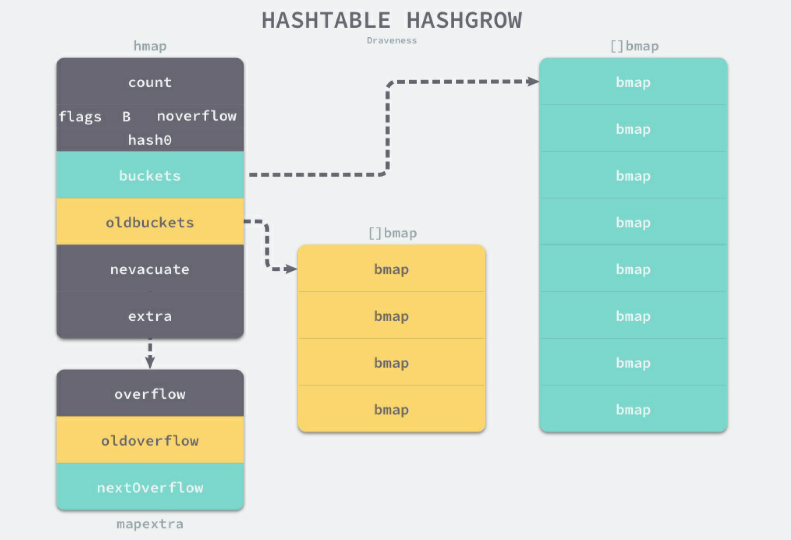
   等量扩容创建了和原来相同的桶数，不会进行数据拷贝。
2. 正常扩容
  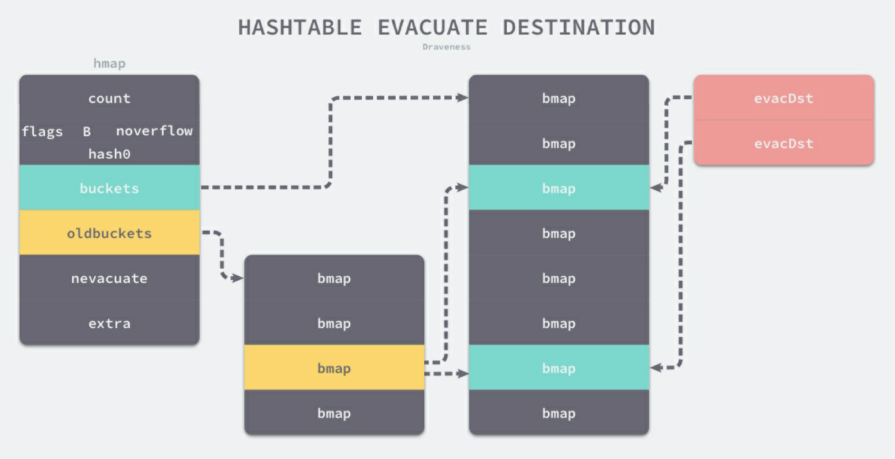
### 字符串
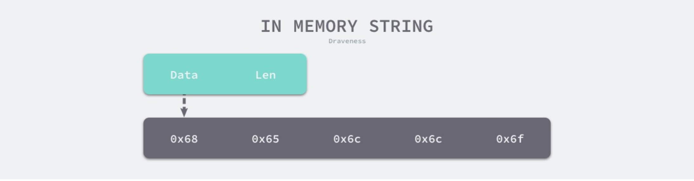
```go
type StringHeader struct {
  Data uintptrt
  Len int
}
```
字符串是只读的，采用直接链接的方式极耗性能。
### 函数调用
`C`与`GO`函数调用区别：
1. `C`语言使用寄存器与栈传递参数，使用`eax`寄存器传递返回值；
2. `GO`使用栈传递参数与返回值。

两种实现方式的优缺点：
1. `C`语言的实现方式极大的减少了函数调用的开销，但增加了实现的复杂度：
   * `CPU`访问栈的开销比寄存器高几十倍；
   * 需要单独处理函数参数过多的情况。

2. `GO`的实现方式降低了实现的复杂度并支持多返回值,但牺牲了函数调用性能：
   * 不需要考虑超过寄存器数量的参数如何传递；
   * 不需要考虑不同架构上寄存器的差异；
   * 函数出参与入参所需空间都在站上分配.

#### 参数传递
1. `golang`中对整形和数组参数传递的方式为值传递。
2. `golang`中所有函数参数均为值传递。

总结：
1. 通过堆栈传递函数，入栈顺序从右到左；
2. 函数返回值通过堆栈传递由调用者预先分内存；
3. 调用函数都是传值，接收方会对入参进行复制在计算。

### 接口
上下游通过接口进行解耦。
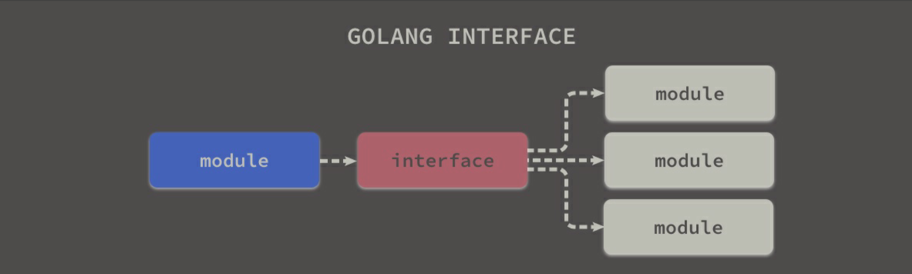
接口分为`iface`与`eface`两种.
`eface`是空接口,结构如下：
```go
type eface struct {
  _type *_type
  data unsafe.Pointer
}
```
`iface`的结构如下：
```go
type iface struct {
  tab *itab
  data unsafe.Pointer
}
```
类型`_type`结构体：
```go
type _type struct{
  size uintptr
  ptrdata uintptr
  hash uint32
  tflag tflag
  align uint8
  fieldAglin uint8
  kind uint8
  equal func(unsafe.Pointer, unsafe.Pointer) bool
  gcdata *byte
  str nameOff
  ptrToThis typeOff
}
```
`itab`结构体：
```go
type itab struct {
  inter *interfacetype
  _type *_type
  hash uint32
  _ [4]byte
  func [1]uintptr
}
```
#### 动态派发(`Dynamic dispatch`)
动态派发(Dynamic dispatch)是在运行期间选择具体多态操作(方法或者函数)执行的过程,它是一种在面向对象语言中常见的特性.
### 反射
`golang`反射主要有两对非常重要的函数与类型。

| 类型             | 含义               |
| ---------------- | ------------------ |
| `refect.TypeOf`  | 获取类型信息       |
| `refect.ValueOf` | 获取数据运行时表示 |

#### 三大法则
1. 从`interface{}`对象可以反射出反射对象；
2. 从反射对象可以获取到`interface{}`变量；
3. 要修改反射对象，其值必须可设置。

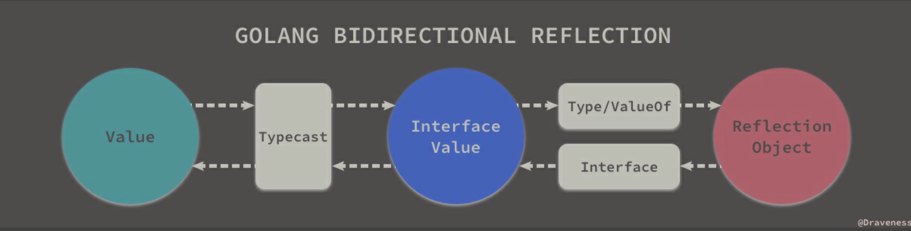
针对第三法则，需要修改一个反射的`value`需要进行以下操作：
1. 调用`refect.ValueOf`获取变量指针;
2. 调用`refect.Value.Elem`获取指针指向的变量；
3. 调用`refect.Value.SetInt`方法更新变量值。

#### 类型和值
`interface{}`在语言内部是通过`emptyInterface`结构体表示的。
```go
type emptyInterface struct {
  typ *rtype // 变量类型
  word unsafe.Pointer // 内部封装数据
}
```

## 常用关键字
### `select`
`select` 控制结构时，存在以下两种现象：
1. `select`在`Channel`上进行非阻塞的收发操作；
2. 多个`Channel`响应时会随机挑选`case`执行。(主要是防止饥饿问题发生)

`select`非阻塞收发，必须含`default`子句；如果存在`case`就绪执行该子句，否则执行`default`子句。
### 数据结构
```go
type scase struct {
  c *hchan
  elem unsafe.Pointer // 接收或发送数据的地址
  kind uint16 // runtime.scase的种类
  pc unintptr
  releasetime int64
}
```
`kind`的种类如下：
```go
const (
  caseNil = iota
  caseRecv
  caseSend
  caseDefault
)
```
`channel`的两个顺序：
1. 轮询顺序，通过`runtime.fastrandn`函数引入随机性；
2. 按照`Channel`的地址排序后确定加锁顺序。

### `defer`
`defer`数据结构：
```go
type _defer struct{
  siz int32 // 参数与结果内存大小
  started bool 
  sp uintptr // 栈指针
  pc uintptr // 调用方计数器
  fn *funcval // defer中传入的函数
  _panic *_panic // 触发延迟调用的结构体，可能为空
  link *_defer
}
```
`GO`语言中将`defer`组装成一个`link`。

`defer`关键字插入时是从后向前，`defer`关键字的执行是从前向后。
### `panic`与`recover`
相关现象：
* `panic`只会触发当前`Goroutine`的延迟函数调用
* `revcver`只有在`defer`函数调用中才会生效
* `panic`允许在`defer`中多次嵌套调用
#### 数据结构
```go
type _panic struct {
  argp unsafe.Pointer  // 指向defer调用的参数指针
  arg interface{} // 指向panic时传入的参数
  link *_panic // 指向更早调用runtime._panic的结构
  recovered bool // 当前runtime._panic是否被recover恢复
  aborted bool // 当前runtime._panic是否被强制终止
  pc uintptr
  sp unsafe.Pointer
  goexit bool
}
```
结构体中`pc、sp和goexit`是为了修复`runtime.Goexit`问题引入的。
#### 程序崩溃
编译器将关键字`panic`装换成`runtime.gopanic`。该函数执行以下步骤：
1. 创建`runtime._panic`结构并添加到所在`Goroutine _panic`链表的最前端；
2. 在循环中不断从当前`Goroutine`的`_defer`链表中获取`runtime._defer`并调用`runtime.reflectcall`运行延迟调用函数；
3. 调用`runtime.fatalpanic`中止整个程序。


### `make和new`
* `make`初始化内置数据；
* `new`根据传入的类型在堆上分配一片内存空间，并返回指向这片内存空间的指针。

### 上下文`Context`
`Context`不但可以用来设置截止日期、同步型号还可以用来传递请求的相关值。
`Context`的主要作用就是在不同的`Goroutine`之间同步特定的数据、取消信号以及处理请求的截止日期。
每一个`Context`会从最顶层的`Goroutine`逐层传递到最下层。
#### 接口
```go
type Context struct{
  Deadline() (deadline time.Time, ok bool)
  Done() <- chan struct{}
  Err() Error
  Value(key interface{}) interface{}
}
```
分析：
1. `Deadline()`返回当前`Context`被取消的时间，即完成工作的截止日期；
2. `Done()`方法返回一个`Channel`，这个`Channel`会在当前工作完成或者上下文被取消后关闭，多次调用`Done()`方法会返回同一个`Channel`；
3. `Err()`返回当前`Context`结束的原因，它只会在`Done`返回的`Channel`关闭时才返回非空的值；
  > * 如果当前`Context`被取消就会返回`Canceled`;
  > * 如果当前`Context`超时就返回`DeadlineExceeded`。

4. `Value`方法会从`Context`放回对应的键值，对同一个`key`多次调用`Value`会返回相同的值。

#### 实现原理
##### 默认上下文
在`context`包中，最常用的还是`context.Background`和`context.TODO`两个方法，这两个方法最终返回一个预先初始化好的私有变量`backgroud和todo`:
```go
func Background(){
  return background
}

func TODO(){
  return todo
}
```
这两个变量是在包初始化时被创建好的，通过`new(emptyCtx)`表达式初始化的指向私有结构体`emptyCtx`的指针。
```go
type emptyCtx int
func (*emptyCtx) Deadline()(deadline time.Time,ok bool ) {
  return
}

func (*emptyCtx) Done() <- chan struct{}{
  return nil
}

func (*emptyCtx) Err() error{
  return nil
}

func (*emptyCtx) Value(key interface{}) interface{}{
  return nil
}

```
### 同步原语与锁
#### `Mutex`
```go
type Mutex struct{
  state int32 // 当前互斥锁的状态
  sema int32 // 控制锁状态的信号量
}
```
共占`8`字节大小。
互斥锁的状态使用`int32`表示，但锁的状态不是互斥的，而是有三种状态：`mutexLocked, mutexWoken和mutexStarving`。
剩下位置表示有多少个`Goroutine`等待互斥锁释放。

互斥锁创建时，所有的位都为`0`,当互斥锁被锁定时 `mutexLocked`就会被置成    `1`、当互斥锁被在正常模式下被唤醒时`    mutexWoken   `就会被被置成 `   1  `、  ` mutexStarving   `用于表示当前的互斥锁进入了状态,最后的几位是在当前互斥锁上等待的` Goroutine `个数。
#### 饥饿模式
互斥锁有两种模式: **正常模式与饥饿模式**。
在正常模式下：所有的`Goroutine`按照先进先出的顺序获取锁，但一个刚刚唤醒的`Goroutine`遇到一个新的`Goroutine`也调用了`Lock`方法，大概率不会获取到锁。
为避免上述情况发生，防止`Goroutine`被饿死，一旦`Goroutine`超过`1ms`没有获取到锁就会切换到饥饿模式。
饥饿模式下：锁优先分配给等待队列的队头部分的`Goroutine`，新的`Goroutine`不能获取到锁也不会进入到自旋状态，只会在末尾等待。当队列最后一个`Goroutine`获取到锁或者等待时间小于`1MS`时，进入正常状态。
#### 加锁
自旋锁只要是防止在多`CPU`机器上，避免并发造成的异常。
当一个线程获取锁时，如果锁已被获取，那么线程将循环等待，并不断试探是否能够获取锁，直到获取到锁退出循环。
#### `RWMutexLock`
```go
type RWMutexLock struct {
  w Mutex
  writerSem uint32
  readerSem uint32
  readerCount int32
  readerWait int32
}
```
加读锁流程：
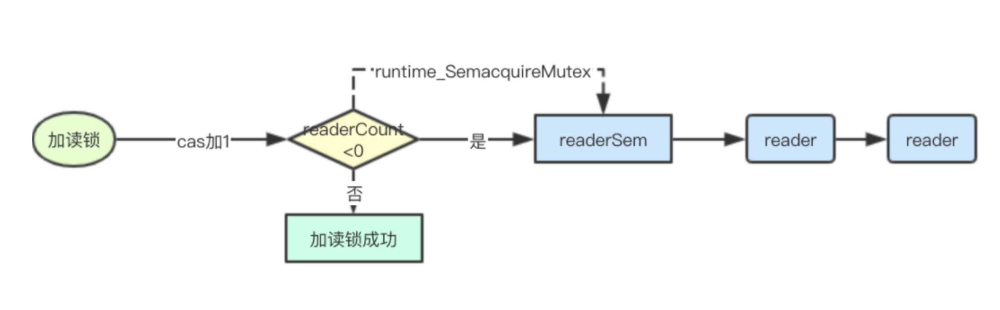
解读锁流程：
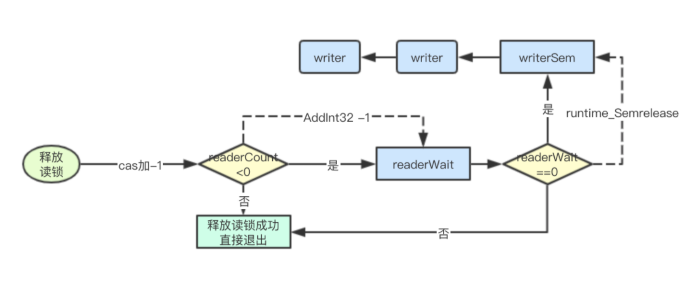
加写锁流程：
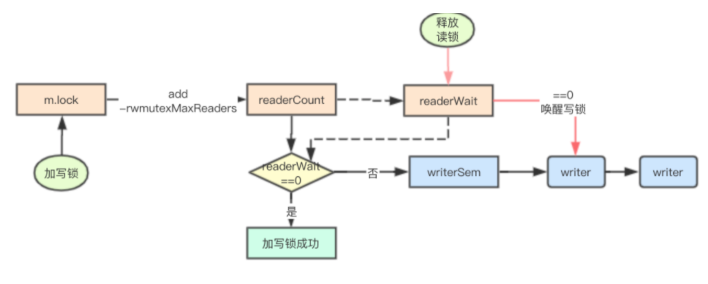
解写锁流程：
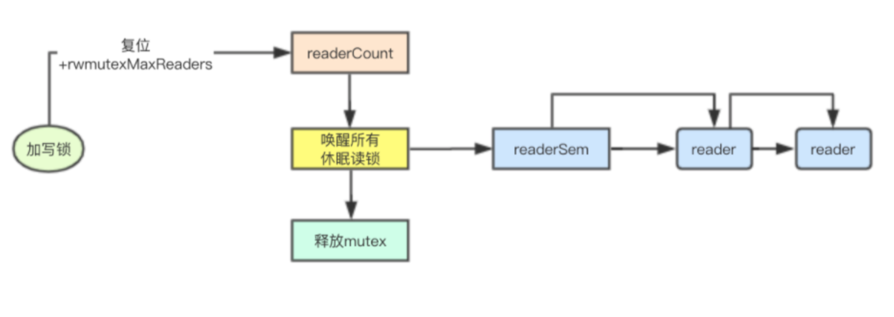
#### `WaitGroup`
多用于批量执行`RPC`或调用外部服务。
```go
type WaitGroup struct {
  noCopy noCopy // 限制拷贝操作
  state1 [3]uint32
}
```
`noCopy`实现：
```go
type noCopy struct{}

func (*noCopy) Lock(){}
func (*noCopy) UnLock(){}
```
通过`go vet`检查。
陷入睡眠的`Goroutine`会在`Add`方法在计数器为`0`时唤醒。

#### `Cond`
```go
type Cond struct {
  noCopy noCopy // 保证编译期间不会copy
  L Locker // 接口，任意实现Lock和UnLock的方法，都可以作为NewCond方法的参数
  notify notifyList // 等待通知列表
  checker copyChecker // 保证运行期间不会copy， 否则panic
}
```
`notifyList`结构体：
```go
type notifyList struct {
  wait int32
  notify int32
  lock mutex
  head *sudog
  tail *sudog
}
```


